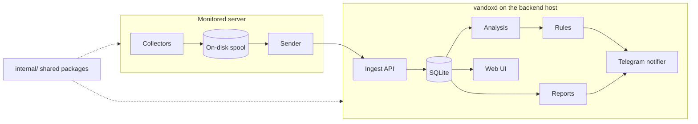
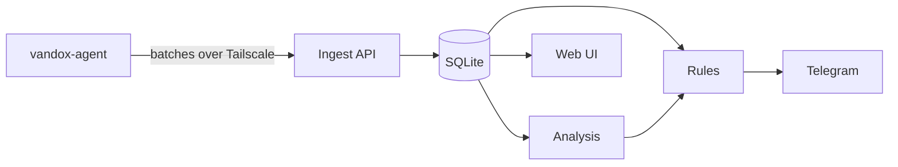
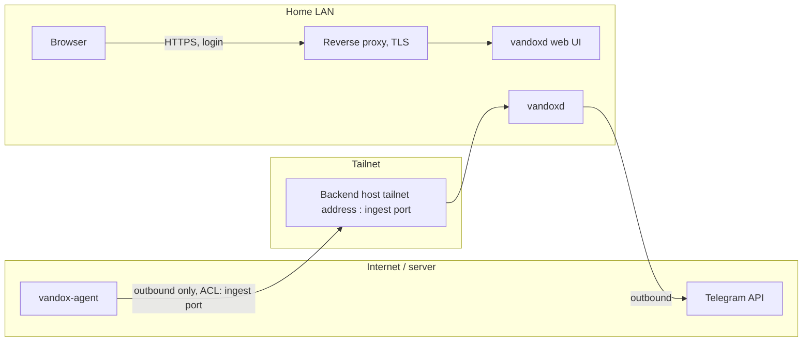

# Architecture

<!-- project:begin architecture -->
Vandox is lean monitoring for a Plesk-managed Linux server, with analysis first: it reconstructs outages
from logs and system metrics and warns early. `vandox-agent` runs on the monitored server; `vandoxd`, the
backend with web UI, runs as a Docker container on any Docker host in the home network (for example a NAS such as Synology or QNAP, a mini PC or a server; called the *backend host* below).

This document describes the target architecture; as of now the binaries' `--version` and the shared data model and wire format
(`internal/model`, `internal/wire`, not yet used by the binaries) exist, and
sections are marked as implemented as features land. The decisions behind it are recorded in
[`docs/decisions/`](decisions/README.md); each section links the records it rests on. Vandox is an own
project rather than an off-the-shelf stack ([0004](decisions/0004-own-project-instead-of-off-the-shelf-stack.md)).

## Monitored server

The monitored server runs Ubuntu 22.04 and Plesk 18 with about 2 GB of RAM. The failure mode Vandox is built
to explain is memory exhaustion, then the OOM killer, then MariaDB, Plesk and mail going down. The RAM stays
at 2 GB; relief comes from swap, tuning the backups and an inventory of running services
([0025](decisions/0025-server-ram-stays-at-2-gb.md)). Services are only disabled in a reversible, documented
way, and agents of the hosting provider are never disabled or changed
([0026](decisions/0026-services-disabled-reversibly-only.md)).

## Components

- `cmd/vandox-agent` — Go, runs as a systemd service on the monitored server. It collects metrics, process
  and network snapshots (read from `/proc`), service and MariaDB state, kernel events and logs, keeps them in
  an on-disk spool and sends them to the backend. It checks the state of the mail services, not individual
  mail accounts. Each collector runs in its own goroutine under a deadline and is abandoned when the
  deadline passes, so a hanging collector or database never blocks the agent; a missed sample is recorded
  as a gap, and a collector that is still stuck is not started again.
- `cmd/vandoxd` — Go, one container on the backend host: ingest API, SQLite storage, analysis, rules, Telegram
  notifier, reports and web UI.
- `internal/` — packages shared by both binaries: data model and versioned wire format (see
  [`WIRE_FORMAT.md`](WIRE_FORMAT.md)), log parsing, signatures, version information, command-line handling.

Importing historical logs (including the legacy `top`/`lsof` log) and continuously shipping new log lines are
core parts of Vandox. Both binaries are written in Go in one module.

Records: [0004](decisions/0004-own-project-instead-of-off-the-shelf-stack.md),
[0005](decisions/0005-go-for-agent-and-backend.md),
[0011](decisions/0011-own-go-web-ui-without-grafana.md),
[0013](decisions/0013-mariadb-access-via-unix-socket-process-privilege.md),
[0014](decisions/0014-log-import-is-a-core-component.md),
[0015](decisions/0015-mail-services-checked-not-mail-accounts.md),
[0019](decisions/0019-agent-reads-proc-instead-of-top-lsof.md),
[0027](decisions/0027-project-name-and-docker-image.md),
[0029](decisions/0029-hanging-collector-never-blocks-the-agent.md),
[0042](decisions/0042-wire-format-gzip-json-lines-standard-library.md),
[0043](decisions/0043-wire-format-major-minor-versioning.md),
[0044](decisions/0044-batch-validated-as-a-whole-agent-records-only.md).

## Data flow

The agent collects data and writes it to its spool, then sends it in batches over Tailscale to the ingest
API. The backend stores the batches in SQLite; analysis, rules, the web UI and Telegram work from the stored
data. Detection, incident reconstruction and alerting are deterministic (rules, thresholds, log signatures);
AI is optional and only used to write the nightly report, which is sent at 06:00, or as soon as the backfill
has completed if the backend host was off at that time. The first release (v0.1.0) is the forensics release:
collection, log import, spool and backfill, storage and the historical views; alerting, the nightly report
and remote actions build on it.

Records: [0006](decisions/0006-agent-connects-outbound-only.md),
[0007](decisions/0007-sqlite-with-fts5-no-external-database.md),
[0008](decisions/0008-deterministic-detection-and-alerting.md),
[0012](decisions/0012-agent-never-contacts-telegram.md),
[0020](decisions/0020-analysis-before-alerting-forensics-release.md),
[0024](decisions/0024-nightly-report-timing.md).

## Network

The agent connects outbound only and never listens on a port. It sends to the ingest port published on the
backend host's tailnet address; `vandoxd` does not embed Tailscale. The Tailscale ACL allows the monitored server to
reach only that port and nothing else. The web UI is reachable in the home LAN only and requires a login;
TLS for it is terminated by a reverse proxy in front of the container (e.g. the NAS's built-in one), while the ingest path bypasses the proxy and is
encrypted by Tailscale. Telegram is contacted only by the backend, never by the agent.

Records: [0010](decisions/0010-tailscale-with-strict-acl.md),
[0016](decisions/0016-web-ui-in-home-lan-with-login.md),
[0017](decisions/0017-ingest-via-tailnet-address-and-published-port.md),
[0023](decisions/0023-tls-through-a-reverse-proxy.md).

## Offline behavior and backfill

The backend host runs 24/7 but is sometimes switched off at night (typically 22:00–09:00) a few times a year. While
the backend is unreachable the agent keeps collecting and spools at least 7 days on disk. When the backend
is reachable again it sends current data first, then backfills the spool chronologically and throttled.
Every agent record carries a sequence number from a persistent per-agent counter, and every batch the
agent's ID; a batch is identified by the agent ID and the sequence numbers of its records, so a resend is
idempotent (the backend stores each agent ID and sequence number once) and the backend can detect gaps. `vandoxd` classifies every record as live or backfilled from its capture time, its receive time and
gaps in the sequence numbers; alert rules are evaluated on live data only, and backfilled data is stored and
analyzed but never alerts. The nightly report waits for the backfill if the backend host was off at 06:00. Data that is
nevertheless lost (agent stopped, spool full, collector timed out) is recorded as a gap, so there are no
data gaps unless explicitly recorded.

Records: [0022](decisions/0022-backfill-detection-and-live-only-alerts.md),
[0024](decisions/0024-nightly-report-timing.md),
[0028](decisions/0028-data-gaps-are-always-recorded.md),
[0044](decisions/0044-batch-validated-as-a-whole-agent-records-only.md),
[0045](decisions/0045-batch-identified-by-agent-id-and-record-sequence-numbers.md),
[0046](decisions/0046-batch-header-describes-the-capture-context.md).

## Storage and retention

`vandoxd` stores everything in SQLite with the FTS5 extension for log search, in WAL mode, with these
retention tiers:

| Data | Retention |
| ---- | --------- |
| Raw data | 30 days |
| 5-minute rollups | 1 year |
| Hourly rollups | 3 years |
| Incidents | unlimited |
| Logs | 90 days |
| Process and connection snapshots | 30 days |

Log data is stored as it is, without pseudonymization: it is the operator's own server and the data stays in
the home network.

Records: [0007](decisions/0007-sqlite-with-fts5-no-external-database.md),
[0021](decisions/0021-no-pseudonymization-of-log-data.md).

## Remote actions (later)

Remote actions are not part of v0.1.0. They exist only as signed commands that reference an action from a
fixed list configured locally on the monitored server, and only after the user has confirmed them. The agent
pulls the commands from the backend and verifies the signature before executing; commands are never pushed
to the server.

Records: [0006](decisions/0006-agent-connects-outbound-only.md),
[0009](decisions/0009-remote-actions-as-signed-commands.md).

## Configuration

Both binaries are configured through a configuration file and environment variables. Configuration loading
is not implemented yet. Secrets are read only from environment variables or Docker secrets, never from the
configuration file ([0032](decisions/0032-secrets-only-from-environment-or-docker-secrets.md)).

## Security model

The agent and the backend communicate only over a private Tailscale network. The agent connects outbound
only and never listens on a port, and the Tailscale ACL lets the monitored server reach only the ingest port
on the backend host. The web UI is protected by a login and runs behind a reverse proxy. The Telegram token
exists only on the backend host. The agent reads MariaDB over the local socket as the user `vandox-agent`, identified
via `unix_socket` and granted only `PROCESS`. Log data is not pseudonymized. Secrets are never logged. The agent runs as the
dedicated user `vandox-agent`, never as root, with only the groups and capabilities listed in `deploy/agent/`
and, from v0.6.0, a polkit rule that allows restarting only the configured units. The two capabilities it
needs to read other users' processes (`CAP_SYS_PTRACE`, `CAP_DAC_READ_SEARCH`) give it root's read access,
so its systemd unit denies the process-attach system calls and grants no write-side capability: a
compromised agent can read everything on the server but cannot use its capabilities to write as or run
code as another user; credentials it reads may still lead to root through other services (password reuse,
Plesk or MariaDB administration)
([0030](decisions/0030-agent-runs-unprivileged-with-named-capabilities.md)). The Telegram bot sends to and
accepts updates only from allowlisted users in their private chats
([0031](decisions/0031-telegram-user-allowlist.md)). Secrets come only from environment variables or Docker
secrets ([0032](decisions/0032-secrets-only-from-environment-or-docker-secrets.md)). The only release
credential, the Docker Hub token, is readable only by the tag-triggered publish job and limited to pushing
`networlddev/vandox` ([0039](decisions/0039-docker-hub-token-in-a-tag-only-environment.md)). Kept
in sync with `SECURITY.md` and the *Security areas* in `.squad/project.md`.

Records: [0006](decisions/0006-agent-connects-outbound-only.md),
[0010](decisions/0010-tailscale-with-strict-acl.md),
[0013](decisions/0013-mariadb-access-via-unix-socket-process-privilege.md),
[0021](decisions/0021-no-pseudonymization-of-log-data.md),
[0030](decisions/0030-agent-runs-unprivileged-with-named-capabilities.md),
[0031](decisions/0031-telegram-user-allowlist.md),
[0032](decisions/0032-secrets-only-from-environment-or-docker-secrets.md),
[0039](decisions/0039-docker-hub-token-in-a-tag-only-environment.md).

## Deployment

The agent is released as a binary for the monitored server, the backend as a Docker image published on
Docker Hub as `networlddev/vandox` ([0027](decisions/0027-project-name-and-docker-image.md)). See the
*Versioning and releases* section in [`CONTRIBUTING.md`](CONTRIBUTING.md).

- The agent binary `vandox-agent-linux-amd64` and `SHA256SUMS` are GitHub release assets.
- The image is built from `deploy/backend/Dockerfile` on a distroless static base and runs as UID 65532.
  The builder and runtime base images are pinned by digest: each `FROM` names an image and a digest from
  build arguments, and the tag is kept in a separate build argument and in the image's OCI base-image
  labels. The release build sets none of these arguments, and the digests are refreshed by hand.
- Releases are built by `.github/workflows/release.yml` only from SemVer tags on `main`. Only the
  repository admin may create these tags (tag ruleset `release-tags`), and the workflow checks that the
  tagged commit is on `main`.
- Release binaries are built from source without restored CI caches and only after `govulncheck` passes.
  The image that was verified is the image that is pushed, and a published version is never overwritten.

Records: [0037](decisions/0037-release-workflow-with-plain-go-docker-and-gh.md),
[0041](decisions/0041-base-images-pinned-by-digest-through-build-arguments.md),
[0039](decisions/0039-docker-hub-token-in-a-tag-only-environment.md).
<!-- project:end architecture -->

## Development process

This repository is developed with AI agents (Claude Code, Codex/GPT, GitHub Copilot) that follow the same
rules: `CLAUDE.md`, `AGENTS.md` and `.github/copilot-instructions.md` hold one shared rule set, and the
skills under `.claude/skills/`, `.agents/skills/` and `.github/skills/` are identical copies. Every pull
request is reviewed before it is opened by the read-only reviewer in `.claude/agents/squad-reviewer.md`
— round 1 is a full review, every later round looks only at the delta, and only blocking findings earn
another round, because a fresh full re-review of unchanged code always finds something new.

The squad skills (`squad-issue`, `squad-spec`) wrap that review in a larger, bounded pipeline described in
[`.squad/routing.md`](../.squad/routing.md): an Opus Lead plans, classifies the change into a tier (`docs`,
`trivial`, `standard`, `security`) that decides how much of the pipeline runs, and owns every decision
including PR approval; for `standard` and `security` a Devil's Advocate challenges the plan once (no veto)
before Security sees it; a Security member reviews the plan (tier `security`) and the diff; tests are
written first and new/changed code reaches at least 80 % line coverage; a Code Officer clears formatting
and analyzer diagnostics *before* the review so the reviewed code is the merged code; and the review loop
is one full pass plus at most two delta rounds. Every limit ends in a Lead decision, and only a decision
the Lead cannot make reaches the human. The stack-specific commands live in
[`.squad/stack.md`](../.squad/stack.md), the project's guarantees and attack surface in
[`.squad/project.md`](../.squad/project.md).

The reasoning behind individual choices is kept out of this document and recorded instead as decision
records in [`docs/decisions/`](decisions/README.md); this document describes how the system works and
links a record where a guarantee or flow is the result of one.
