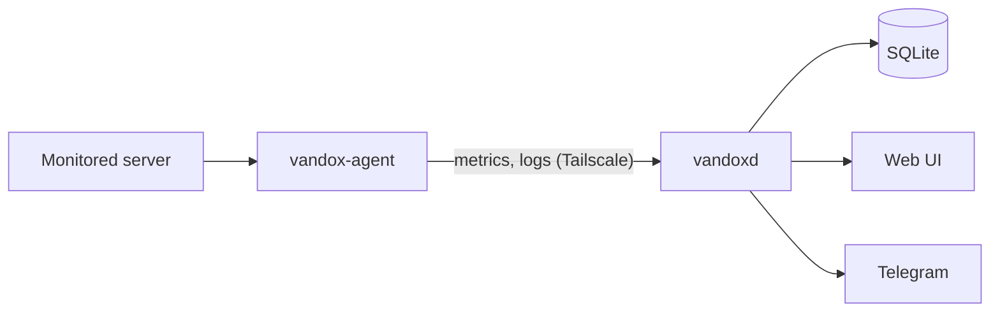

# Architecture

<!-- project:begin architecture -->
Vandox is lean monitoring for a Plesk-managed Linux server, with analysis first: it reconstructs outages
from logs and system metrics and warns early. `vandox-agent` runs on the monitored server; `vandoxd`, the
backend with web UI, runs as a Docker container on a Synology NAS in the home network.

## Components

- `cmd/vandox-agent` — collects metrics and logs on the monitored server, keeps them in an on-disk spool and
  sends them to the backend.
- `cmd/vandoxd` — the backend: ingest API, SQLite storage, log analysis, alerting and web UI.
- `internal/` — packages shared by both binaries: data model and versioned wire format, log parsing,
  signatures, version information.

## Main flow

The agent collects metrics and ships logs, spools them on disk and transmits them to the backend, which
stores and analyzes them and raises alerts. The detailed flow and its guarantees are documented here as the
features land; the planned guarantees are listed in `.squad/project.md` (*Guarantees*).

## Configuration

Both binaries are configured through a configuration file and environment variables. Configuration loading
is not implemented yet.

## Security model

The agent and the backend communicate only over a private Tailscale network. The web UI is protected by a
login and runs behind the Synology reverse proxy. Secrets are never logged. Kept in sync with `SECURITY.md`
and the *Security areas* in `.squad/project.md`.

## Deployment

The agent is released as a binary for the monitored server, the backend as a Docker image. See the
*Versioning and releases* section in [`CONTRIBUTING.md`](CONTRIBUTING.md).
<!-- project:end architecture -->

## Development process

This repository is developed with AI agents (Claude Code, Codex/GPT, GitHub Copilot) that follow the same
rules: `CLAUDE.md`, `AGENTS.md` and `.github/copilot-instructions.md` hold one shared rule set, and the
skills under `.claude/skills/`, `.agents/skills/` and `.github/skills/` are identical copies. Every pull
request is reviewed before it is opened by the read-only reviewer in `.claude/agents/squad-reviewer.md`
— round 1 is a full review, every later round looks only at the delta, and only blocking findings earn
another round, because a fresh full re-review of unchanged code always finds something new.

The squad skills (`squad-issue`, `squad-spec`) wrap that review in a larger, bounded pipeline described in
[`.squad/routing.md`](../.squad/routing.md): an Opus Lead plans, classifies the change into a tier (`docs`,
`trivial`, `standard`, `security`) that decides how much of the pipeline runs, and owns every decision
including PR approval; for `standard` and `security` a Devil's Advocate challenges the plan once (no veto)
before Security sees it; a Security member reviews the plan (tier `security`) and the diff; tests are
written first and new/changed code reaches at least 80 % line coverage; a Code Officer clears formatting
and analyzer diagnostics *before* the review so the reviewed code is the merged code; and the review loop
is one full pass plus at most two delta rounds. Every limit ends in a Lead decision, and only a decision
the Lead cannot make reaches the human. The stack-specific commands live in
[`.squad/stack.md`](../.squad/stack.md), the project's guarantees and attack surface in
[`.squad/project.md`](../.squad/project.md).

The reasoning behind individual choices is kept out of this document and recorded instead as decision
records in [`docs/decisions/`](decisions/README.md); this document describes how the system works and
links a record where a guarantee or flow is the result of one.
